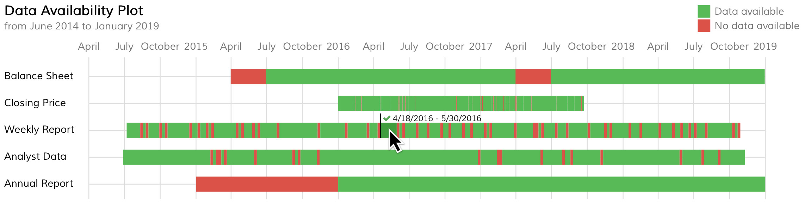

Visavail.js - A Time Data Availability Chart
=============================
This library visualizes the availability of time-dependent data with a chart on a website.

Description
-----------
The Visavail.js chart allows a quick insight into which periods of time a time-dependent dataset covers. It is visually similar to a Gantt chart and allows easy identification of missing pieces and gaps in large datasets. Missing periods of data are marked in red while blocks of complete periods of data are marked in green. The user discovers dates that define start and end of such periods by tooltips, as shown in the picture below.



An example use case is the visualization of a dataset that contains time-dependent stock market data. The question the Visavail.js chart tries to answer is

*"Do I have continuous stock market data in my dataset and if not, where are the gaps?"*

The Visavail.js library takes single data points with dates and information about data availability as inputs, combines them into time blocks, and visualizes these blocks.

Demo
----
A demo of Visavail.js in action is displayed at [http://bit.ly/1tevllL](http://bit.ly/1tevllL). The source code of the demo is shown in the file [example_basic.htm](examples/example_basic.htm).

Usage
-----
Input data format, display style and dependencies have to be considered for using the Visavail.js library successfully. The respective code snippets are explained below.

### Input Data Format
The input to the Visavail.js library is a JSON-like structure. There are three formats that Visavail.js accepts. Which format is right for you depends on your use case.

#### Continuous Data
You should use the continuous data format if you want to display continuous recordings. Visavail.js assumes that information about the availability of some data is valid until the next data point shows up.
Thus, the library will plot a continuous bar from the first to the last data point. The last data point will be assumed valid for a period of `"interval_s"`.
The below code comments point out the elements that should be included in the input data.
```javascript
var dataset = [{
    "measure": "Annual Report", // name of the data series, will become y-axis label
    "interval_s": 365 * 24 * 60 * 60, // time period in seconds a single data point is expected to cover
    "data": [
        ["2015-01-01", 0], // data as arrays of period start data string and bit determining
                           // if data are available for that period
        ["2016-01-01", 1],
        ["2017-01-01", 1],
        ["2018-01-01", 1]
    ]
}];
```

#### Data With Time Gaps
You should use the time gap data format if you want to display recordings that are not continuous. The availability data are valid for a specific period of time. This period is defined by a start
and an end date, as shown in the code below. In this case, no information about `"interval_s"` (as explained in the previous use case) is needed.
```javascript
var dataset = [{
    "measure": "Annual Report", // name of the data series, will become y-axis label
    "data": [
        ["2015-01-01", 0, "2015-03-04"], // data as arrays of period start data string,
                                         // bit determining if data are available for that
                                         // period and period end data string
        ["2016-01-01", 1, "2016-03-03"],
        ["2017-01-01", 1, "2017-03-06"],
        ["2018-01-01", 1, "2018-04-01"]
    ]
}];
```

#### Data With Dates and Times
The library also supports the display of data in smaller units than days as in the previous examples. Visavail.js currently supports display of data in second intervals. The code below is based on the time gap data format outlined above.
To display date and time data correctly, all data must be formatted in a 24-hour format.
```javascript
var dataset = [{
    "measure": "Room Occupancy", // name of the data series, will become y-axis label
    "data": [
        ["2016-01-01 12:00:00", 1, "2016-01-01 13:00:00"], // 24-hour format
        ["2016-01-01 14:22:51", 1, "2016-01-01 16:14:12"],
        ["2016-01-01 19:20:05", 0, "2016-01-01 20:30:00"],
        ["2016-01-01 20:30:00", 1, "2016-01-01 22:00:00"]
    ]
}];
```

#### Data With Custom Categories
If you want to show data in other categories than "data available" and "no data available", the following example is for you. Visavail.js also supports displaying data in custom categories. In this case, you have to assign all of your categories a name and a color that is used for displaying the category in the chart.

The chart legend will not appear on charts with data in custom categories. Instead, the category name will be shown in the tooltip that appears when you hover over the bars in the chart. See the code below for an example.
```javascript
var dataset = [{
    "measure": "Fat Bike",
    "categories": { // category names and their colors defined here
        "Kim": { "color": "#377eb8" },
        "Bert": { "color": "#ff7f00" },
        "Zoe": { "color": "purple" },
        },
    "data": [
        ["2016-01-01 12:00:00", "Kim", "2016-01-01 13:00:00"],
        ["2016-01-01 14:22:51", "Zoe", "2016-01-01 16:14:12"],
        ["2016-01-01 16:14:12", "Bert", "2016-01-01 17:14:12"],
        ["2016-01-01 19:20:05", "Zoe", "2016-01-01 20:30:00"]
    ]
}];
```

#### Linking Measure Labels
If you want to add a link to your measure label, you can do so by adding an URL through the `measure_url` property in the `dataset`. Here is an example:
```javascript
var dataset = [{
    "measure": "Annual Report",
    "measure_url": "http://www.github.com/flrs/visavail" // link definition
    "interval_s": 365 * 24 * 60 * 60,
    "data": [
        ["2015-01-01", 0], 
        ["2016-01-01", 1],
        ["2017-01-01", 1],
        ["2018-01-01", 1]
    ]
}];
```

#### Measure Labels with HTML
Measure labels can be expressed in full HTML via the `measure_html` property in the `dataset`. Here is an example:
```javascript
var dataset = [{
    "measure_html": "<span title='Price of security at end of day'>&#x1F6AA; Closing Price</span>", // HTML code
    "interval_s": 365 * 24 * 60 * 60,
    "data": [
        ["2015-01-01", 0], 
        ["2016-01-01", 1],
        ["2017-01-01", 1],
        ["2018-01-01", 1]
    ]
}];
```


### Display Style
The display style of the chart is defined by a CSS style. The names of the different CSS classes in the [CSS style file](visavail/css/visavail.css) are self-explanatory.

### Implementation
To use the chart in your project, follow these steps:

1. Copy the `vendors` folder and the `visavail` folder to the *root folder* of your project.

2. Assuming that your website is in the *root folder*, add the following lines to the `<head>` of your website:
    ```html
    <link href="https://fonts.googleapis.com/css?family=Muli" rel="stylesheet" type="text/css">
    <link href="./visavail/css/visavail.css" rel="stylesheet" type="text/css">
    <link href="./vendors/font-awesome/css/font-awesome.min.css" rel="stylesheet" type="text/css">
    ```
3. And the following lines to the `<body>` of your website:
    ```html
    <script src="./vendors/moment/moment-with-locales.min.js" type="text/javascript"></script>
    <script>
        moment.locale("en");
    </script>
    <script src="./vendors/d3/d3.min.js" charset="utf-8"></script>
    <script type="text/javascript">
        var dataset = ... // see examples/example_basic.htm
    </script>
    <script src="./visavail/js/visavail.js"></script>
    
    <p id="example"><!-- Visavail.js chart will be inserted here --></p>
    
    <script>
        var chart = visavailChart().width(800); // define width of chart in px
        d3.select("#example")
                .datum(dataset)
                .call(chart);
    </script>
    ```

Examples
--------
Five examples are provided with Visavail.js.

1. **Basic Example** The [basic example](examples/example_basic.htm) gives you the quick "plug and play" experience.

2. **Time Gap Example** Check out the [time gap example](examples/example_timegaps.htm) for getting to know how to define time gaps in your input dataset.

3. **Pagination with Bootstrap** As datasets grow bigger, you might want to display the data in pages. [This Bootstrap pagination example](examples/example_pagination_bootstrap.htm) has you covered.

4. **Responsive Layout with Bootstrap** When optimizing for mobile, [this example with responsive layout](examples/example_responsive_bootstrap.htm) is a good starting point.

5. **Dates and Times** When you also want to display times and not only dates, [the dates and times example](examples/example_dates_and_times.htm) shows you how.

6. **Custom Category Data** Categories other than "data available" and "no data available" can be used, as shown in [the custom category data example](examples/example_custom_categories.htm).

7. **Linked Measure Labels** For adding a link to the measure labels, [the linked labels example](examples/example_linked_labels.htm) shows how it is done.

8. **Measure Labels with HTML** If adding a link to the measure labels is not enough, you can make them full HTML, as explained in the [HTML labels example](examples/example_html_labels.htm).

Download
--------
An archive with the library can be downloaded from the [releases page](https://github.com/flrs/visavail/releases).

Dependencies
------------
Visavail.js depends on a couple of libraries:
* [D3.js JavaScript library](https://d3js.org/) as a visualization framework,
* [Moment.js](http://momentjs.com/) for formatting dates in tooltips and
* [Font Awesome](http://fontawesome.io) for icons in the tooltips.

Contribution
------------
I am happy about any contribution or feedback. Please let me know about your comments via the Issues tab on [GitHub](https://github.com/flrs/visavail/issues).

License
-------
The Visavail.js library is distributed under the [MIT License (MIT)](https://github.com/flrs/visavail/blob/master/LICENSE.md). Please also take note of the licenses of the dependencies.
